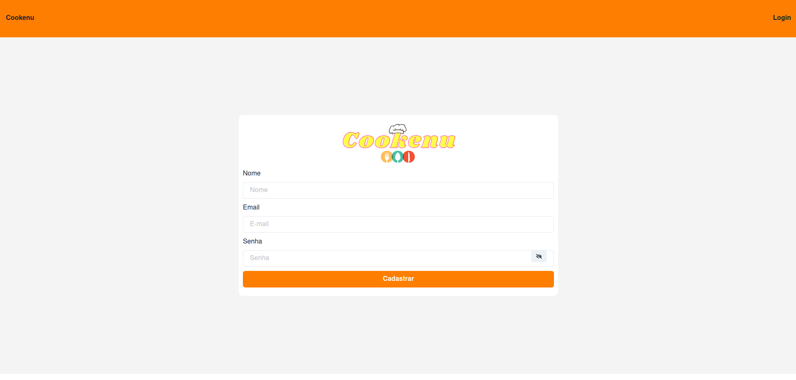
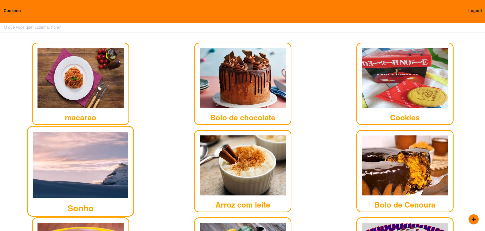
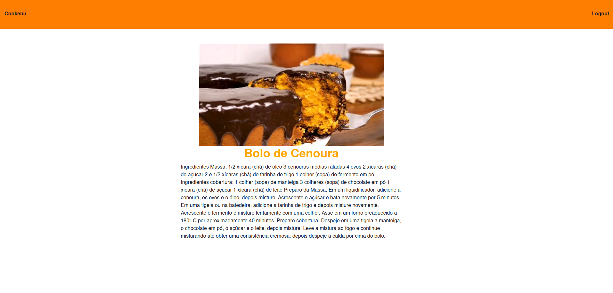

# Cookenu

Site de receitas que utiliza a API Cookenu. Nesse site é possível fazer login, cadastro, visualizar o feed de receitas, pesquisar e adicionar uma nova receita.

### Tecnologias utilizadas
1. React.js
2. JavaScript
3. Chakra

### Como rodar este projeto
É importante que tenha o [Node](https://nodejs.org/en) instalado na sua máquina.
1. Faça o clone deste repositório:
```bash
    git clone https://github.com/carolcampos22/projeto-cookenu
```
2. Entre no diretório (pasta) do projeto:
```bash
    cd projeto-cookenu/cookenu
```
3. Inicie o projeto:
```bash
    npm run start
```
O projeto será aberto em seu navegador padrão, na porta localhost:3000. 

### Site do projeto
O site pode ser visualizado no link https://spooky-bone.surge.sh//

### Layout
1. Página de Login:


2. Página de Cadastro:


3. Feed de receitas:


4. Página de detalhes de receita:


### Próximos passos
- Modos claro e escuro
- Animação informando quando um conteúdo estiver carregando
- Algumas melhorias na estilização

### Autora
#### Carolina Mendes - Web developer
[](https://www.linkedin.com/in/dev-carolina-mendes/)

